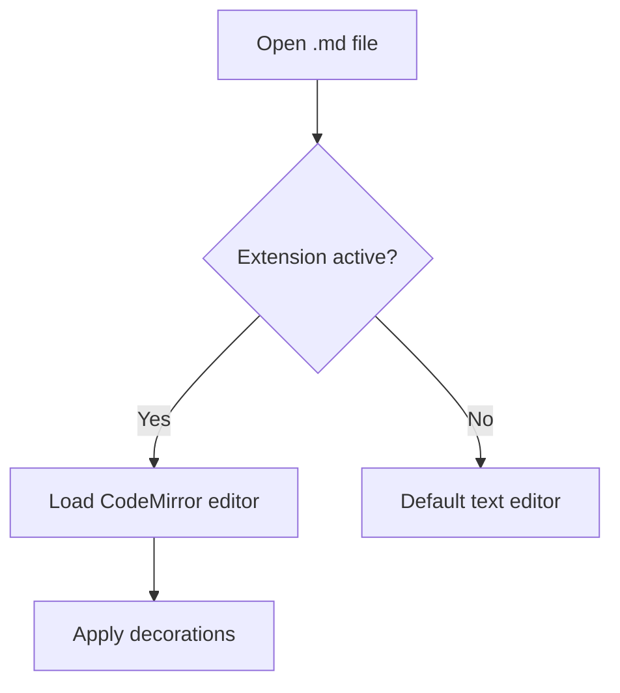
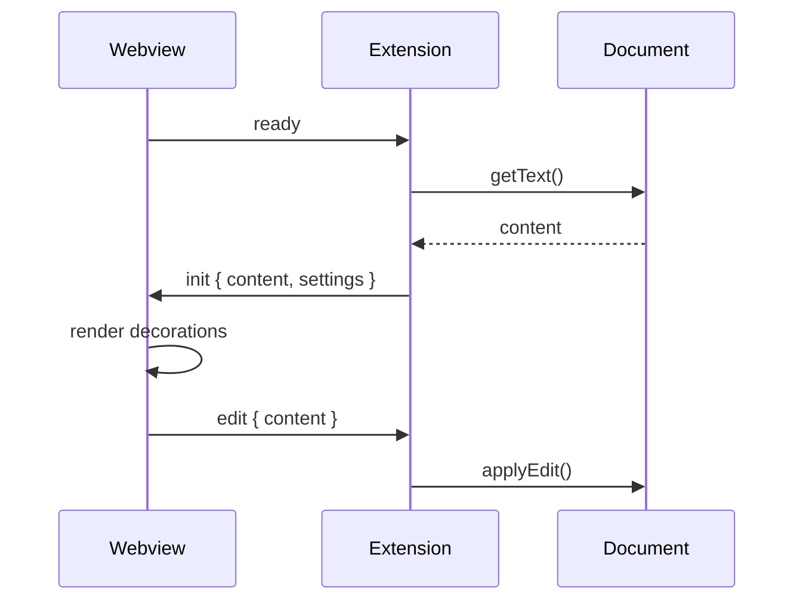
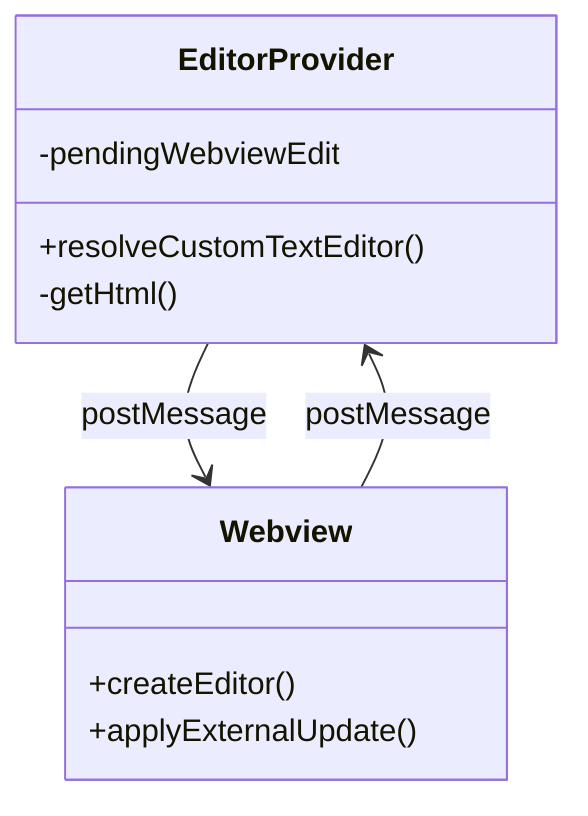
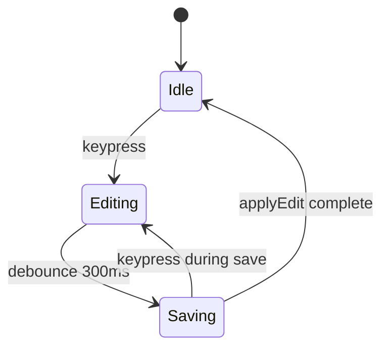
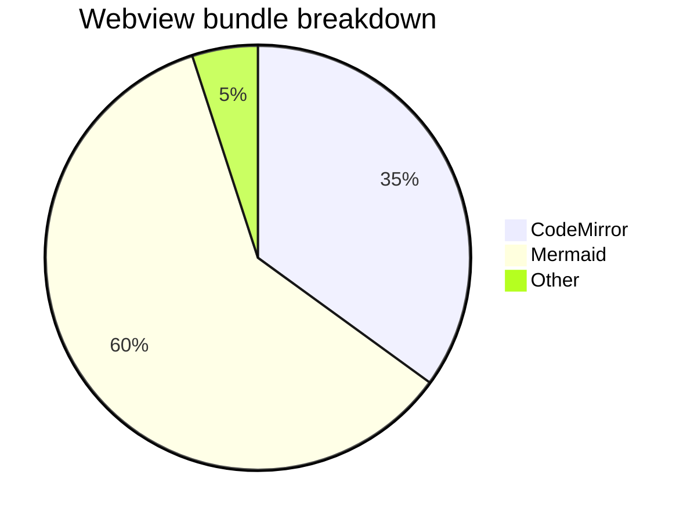
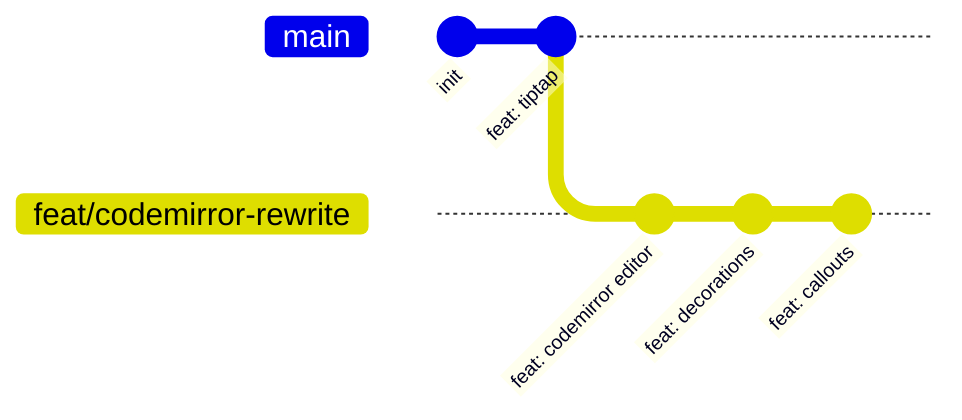

# Mermaid Diagrams

← [Back to test suite](test.md)

---

## Flowchart

```mermaid
flowchart TD
    A[Open .md file] --> B{Extension active?}
    B -- Yes --> C[Load CodeMirror editor]
    B -- No --> D[Default text editor]
    C --> E[Apply decorations]
```

---

## Sequence Diagram

```mermaid
sequenceDiagram
    participant W as Webview
    participant E as Extension
    participant D as Document
    W->>E: ready
    E->>D: getText()
    D-->>E: content
    E->>W: init { content, settings }
    W->>W: render decorations
    W->>E: edit { content }
    E->>D: applyEdit()
```

---

## Class Diagram

```mermaid
classDiagram
    class EditorProvider {
        +resolveCustomTextEditor()
        -getHtml()
        -pendingWebviewEdit
    }
    class Webview {
        +createEditor()
        +applyExternalUpdate()
    }
    EditorProvider --> Webview : postMessage
    Webview --> EditorProvider : postMessage
```

---

## State Diagram

```mermaid
stateDiagram-v2
    [*] --> Idle
    Idle --> Editing : keypress
    Editing --> Saving : debounce 300ms
    Saving --> Idle : applyEdit complete
    Saving --> Editing : keypress during save
```

---

## Pie Chart

```mermaid
pie title Webview bundle breakdown
    "CodeMirror" : 35
    "Mermaid" : 60
    "Other" : 5
```

---

## Git Graph

```mermaid
gitGraph
    commit id: "init"
    commit id: "feat: tiptap"
    branch feat/codemirror-rewrite
    checkout feat/codemirror-rewrite
    commit id: "feat: codemirror editor"
    commit id: "feat: decorations"
    commit id: "feat: callouts"
```
