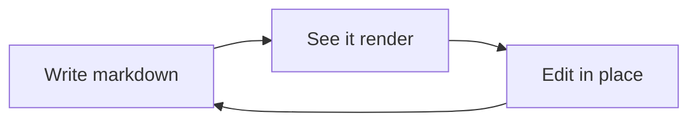

# Welcome to Marksmith M§

This is your **playground** — a scratch copy, so poke at anything and break everything. Your edits stay here and never touch your projects. Reopen it anytime with **Marksmith: Open Playground**.

> [!TIP] Everything below is live and editable.
> There's no separate preview pane — what you see _is_ the markdown. Click into any block and start typing.

---

## The basics

You get **bold**, _italic_, ~~strikethrough~~, and `inline code`. Links are clickable — ⌘/Ctrl-click [the Marksmith repo](https://github.com/trenaryja/vscode-extensions) to open it. Bare URLs autolink too: https://commonmark.org.

> A blockquote, for when you're quoting someone wiser than yourself.

- Unordered lists
  - nest as deep as you like
    - really, as deep as you like
- Ordered lists too:

1. First
2. Second
3. Third

- [x] Task lists work
- [ ] …and you can check them off

---

## Tables are a data grid

Stop counting pipes. **Click any cell to edit it in place**, and **drag the row/column handles to reorder**. When you're done, Marksmith writes the table exactly the way Prettier would — so your formatter never fights you.

| Feature  |  Flavor  | Ships |
| :------- | :------: | ----: |
| Tables   |   GFM    |    ✅ |
| Callouts | Obsidian |    ✅ |
| Math     |  LaTeX   |    ✅ |
| Diagrams | Mermaid  |    ✅ |

> [!NOTE] The emoji column stays aligned.
> Alignment is display-width aware (emoji and CJK count as two columns) — byte-for-byte what your own Prettier would produce.

---

## Callouts

> [!TIP] Callouts come in many flavors
> note, tip, important, warning, caution, quote, example… and you can add your own.

> [!WARNING]- Foldable callouts start collapsed
> Add a `-` after the type to start folded, or `+` to start open. Click the title to toggle me.

> [!QUOTE] They nest, too
> > [!INFO] A callout inside a callout,
> > with **lists**, `code`, and even math inside if you like.

Override any type's icon or color with the `marksmith.callouts` setting.

---

## Math

Inline math like $e^{i\pi} + 1 = 0$ renders as you type. Block math gets centered on its own line:

$$
\int_{-\infty}^{\infty} e^{-x^2}\,dx = \sqrt{\pi}
$$

Hover a block equation and hit its **Copy SVG** button to lift it out as vector art.

---

## Code blocks

Syntax highlighting tracks your VS Code theme (powered by Shiki):

```ts
const greet = (name: string) => `Hello, ${name}!`
console.log(greet('Marksmith'))
```

```python
def fib(n):
    a, b = 0, 1
    for _ in range(n):
        a, b = b, a + b
    return a
```

---

## Diagrams

Fenced `mermaid` blocks render as diagrams:



---

## Images & rules

Images render inline, and their URLs are clickable:


And a thematic break closes us out:

---

That's the tour. Delete it all and start from a blank page, or keep tinkering here. Happy writing. M§
