# Mermaid Diagrams

← [Back to test suite](test.md)

Colors come from mermaid's own `default` (light) / `dark` theme — not your VS Code theme.
Per-diagram overrides are possible via `classDef` / `style` (see the flowchart) or `%%{init}%%` directives.

---

## Flowchart (with styling)

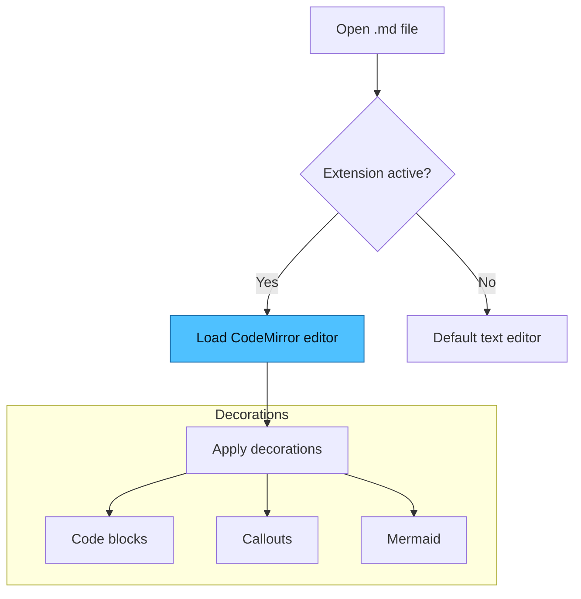

---

## Sequence Diagram

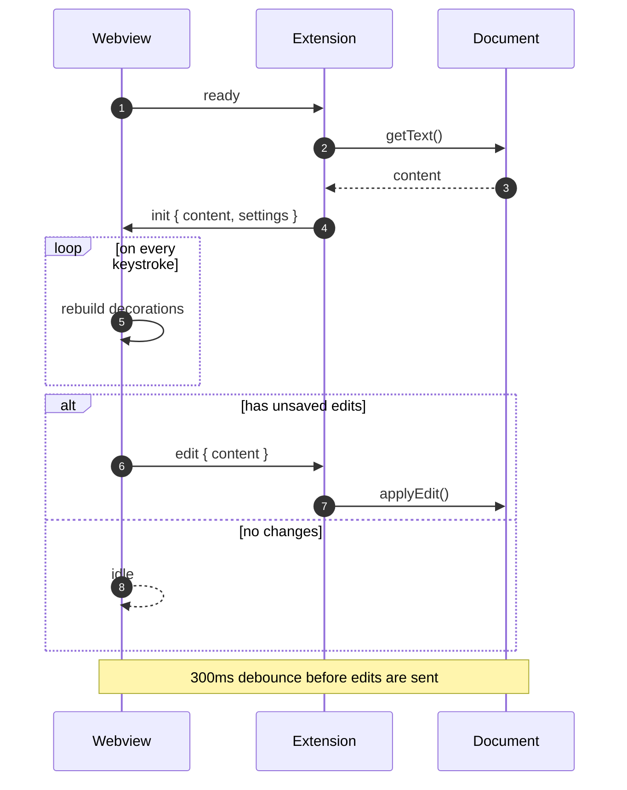

---

## Class Diagram

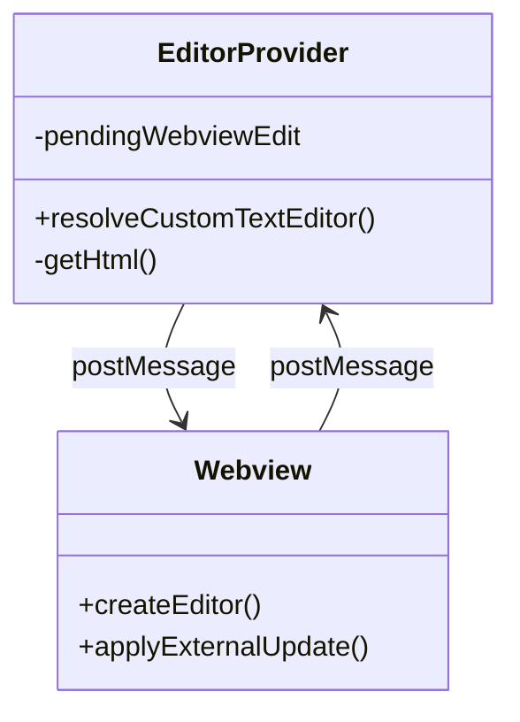

---

## State Diagram

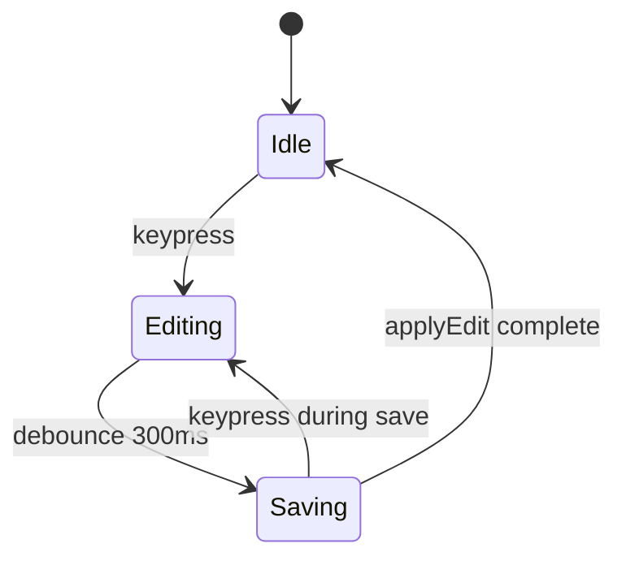

---

## Entity Relationship

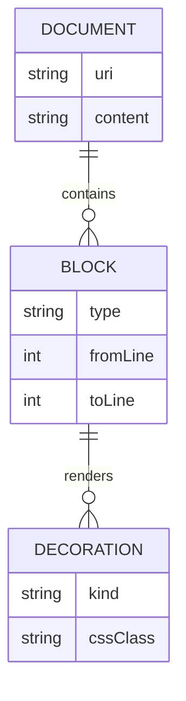

---

## User Journey

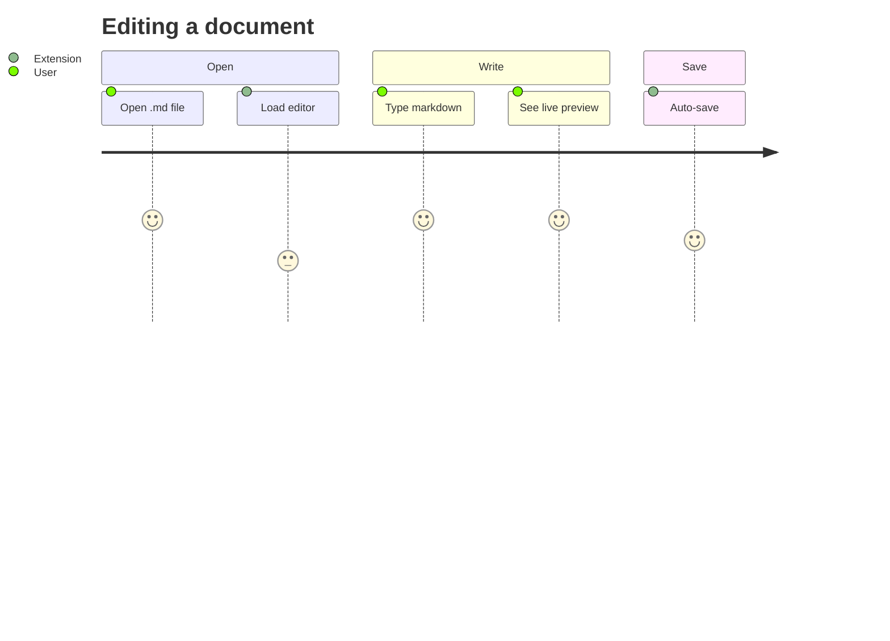

---

## Gantt Chart

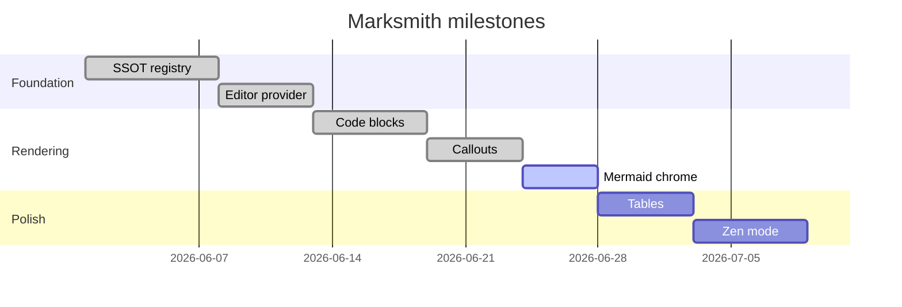

---

## Pie Chart

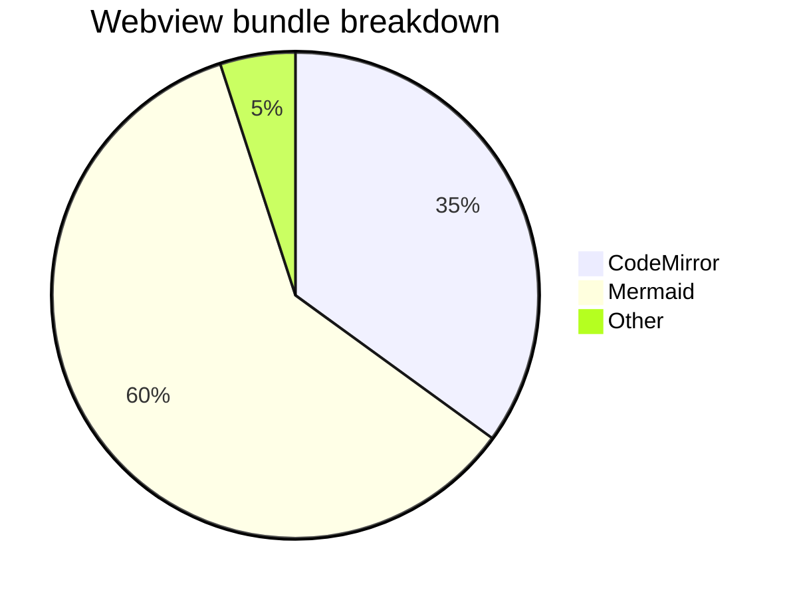

---

## Mindmap

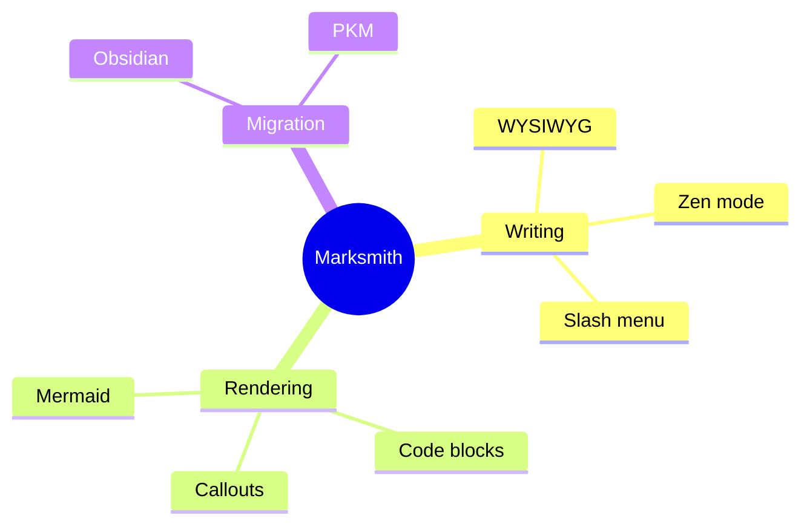

---

## Timeline

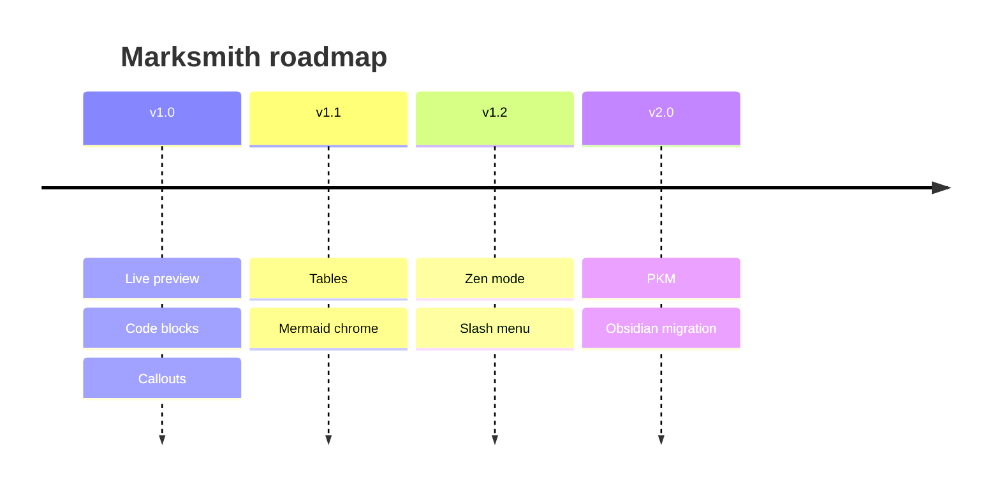

---

## Quadrant Chart

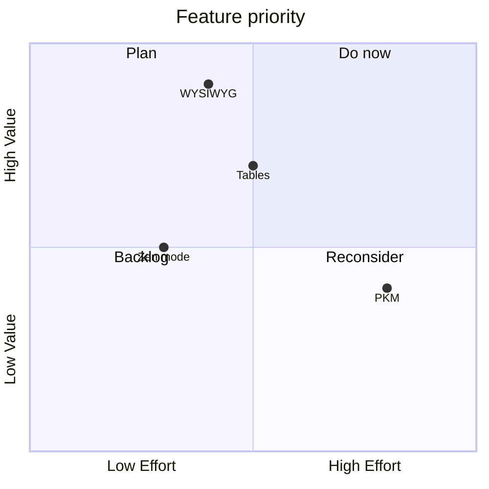

---

## Git Graph

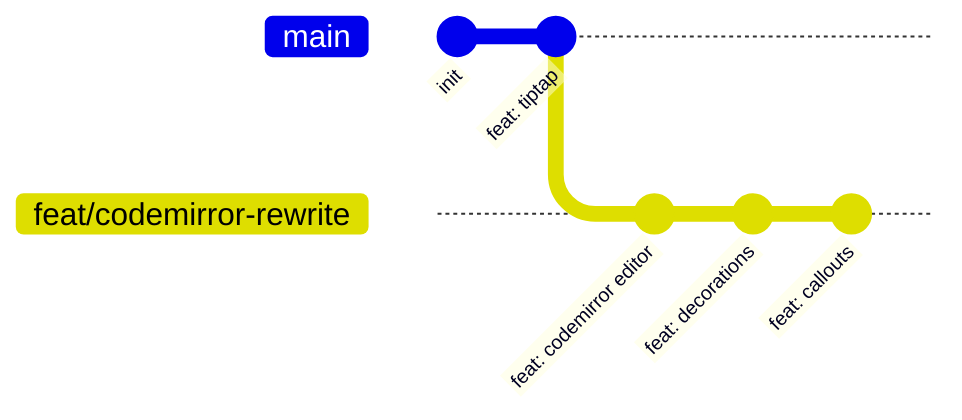

---

## Requirement Diagram

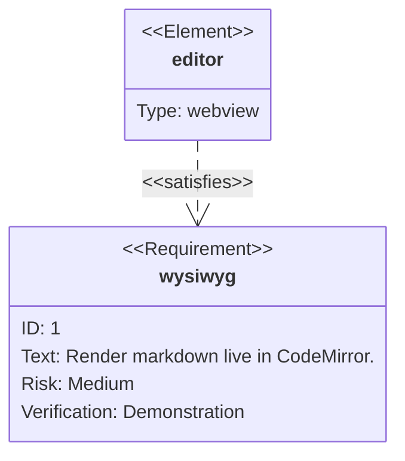

---

## XY Chart

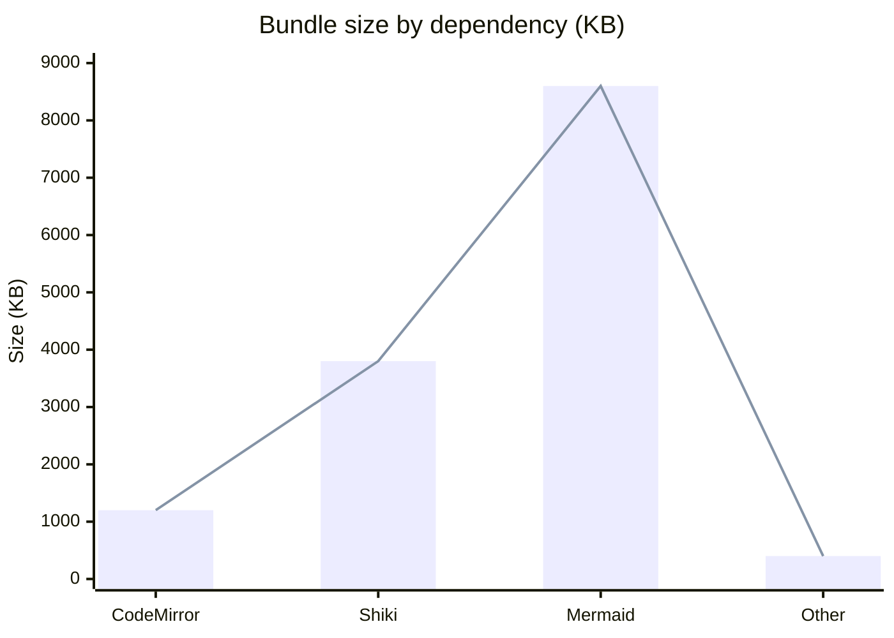

---

## Sankey Diagram

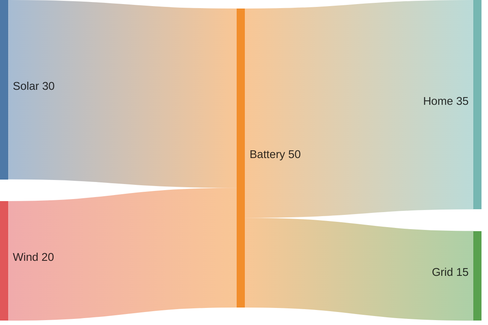

---

## Block Diagram

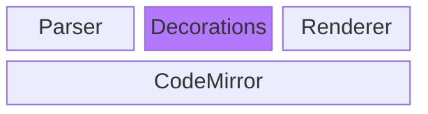

---

## Packet Diagram

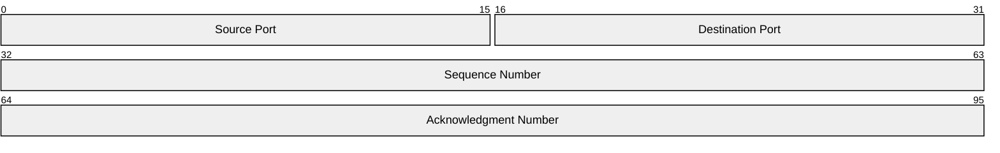

---

## Kanban

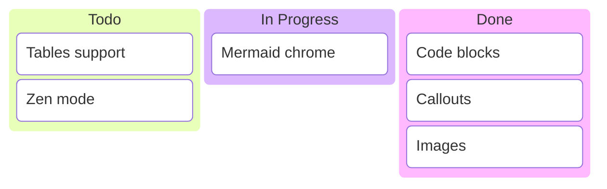
